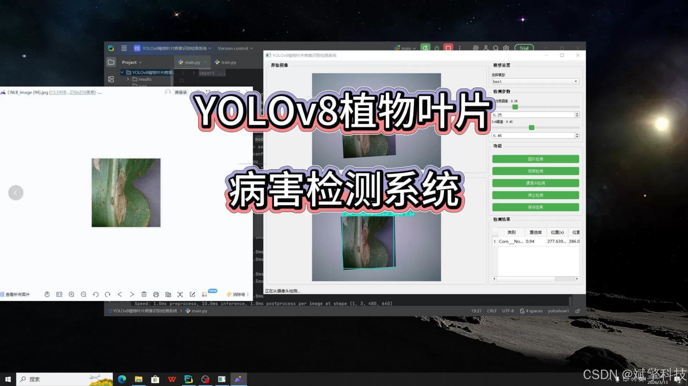
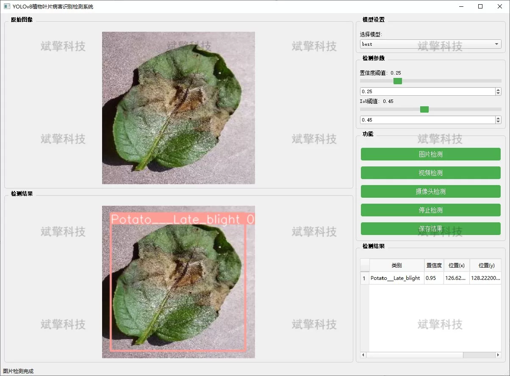
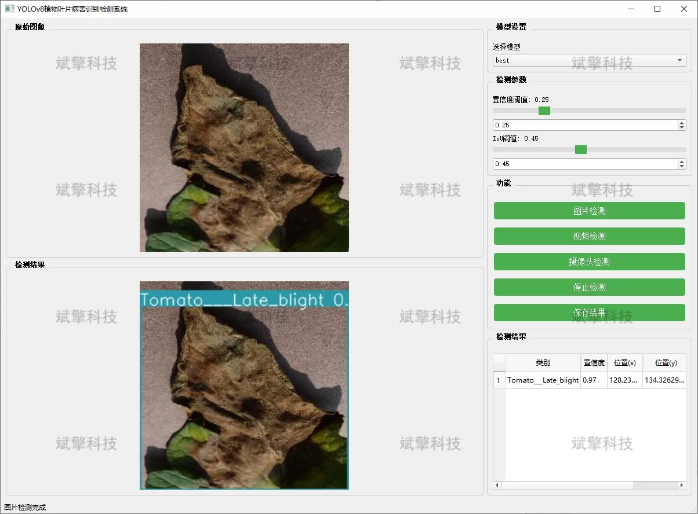
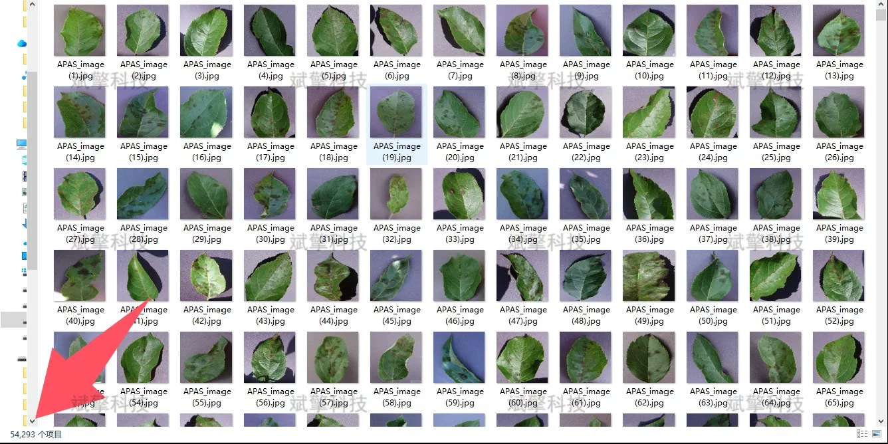
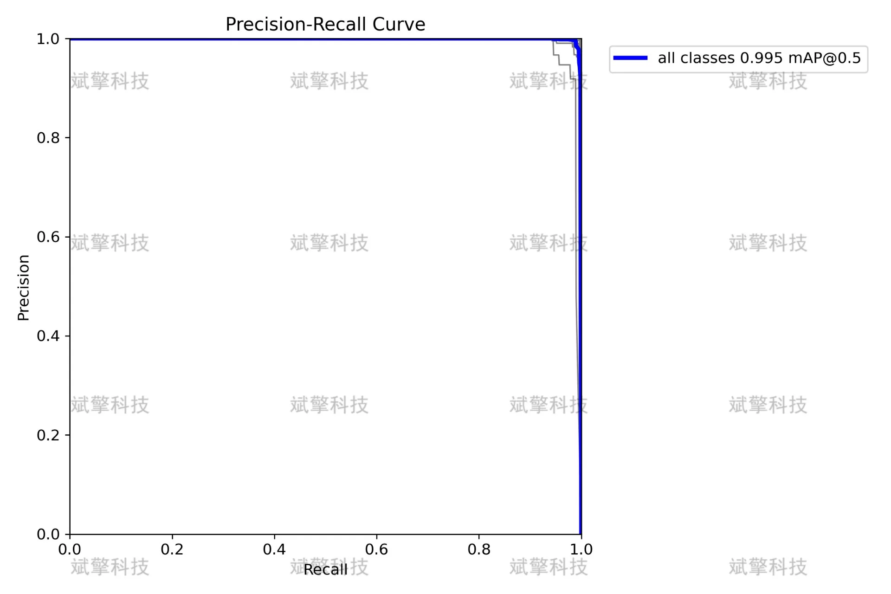
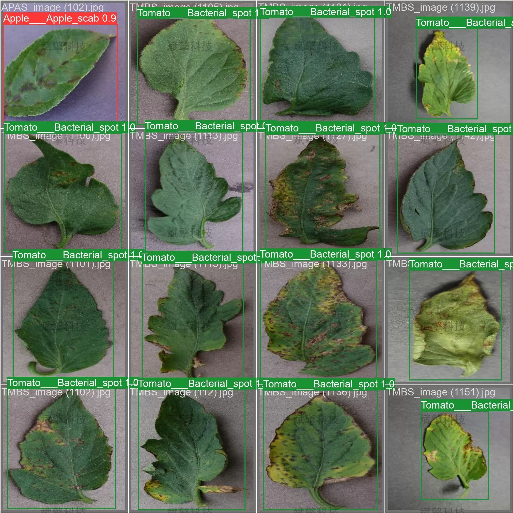

# YOLOv8 Plant Disease Detection Software

## Body

YOLOv8 Plant Disease Detection Software, based on the YOLOv8 deep learning algorithm, has been designed and implemented to develop a multifunctional plant leaf disease recognition detection system. The system covers three modes: image detection, video detection, and real-time camera detection, capable of accurately recognizing 38 leaf states of 14 crops including apples, blueberries, cherries, corn, grapes, citrus fruits, peaches, chili peppers, potatoes, raspberries, soybeans, pumpkins, and strawberries. It includes various common diseases as well as healthy leaves. The system consists of three major functional modules: image detection, video detection, and real-time camera detection, which can be widely applied in agricultural production bases, plant protection stations, agricultural research institutions, and intelligent agricultural mobile terminals.

System Features
✅ Image Detection: Can detect images and return detection boxes and category information.
✅ Video Detection: Supports input of video files, detecting each frame in the video.
✅ Real-Time Camera Detection: Connects USB cameras for real-time monitoring.
✅ Parameter Adjustment (Confidence and IoU Thresholds)
Dataset Overview
Total number of images: 54,293

## Images

## Payment

Here is a pay link on Stripe ( https://buy.stripe.com/3cs8yP7sY87d0vu9AB ). Please contact me lonlonago@foxmail.com after funding $89, and I will send you a complete data files , thank you!

